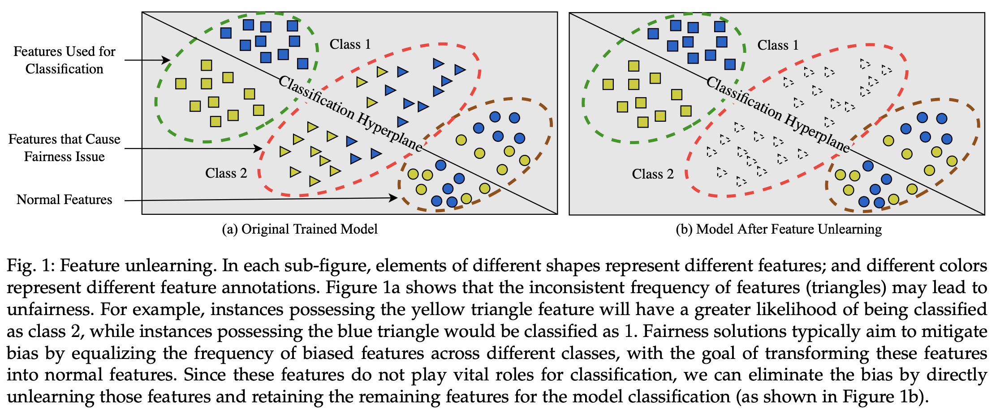

# Don’t Forget Too Much: Towards Machine Unlearning on Feature Level

This repository contains a Python implementation of [Don’t Forget Too Much: Towards Machine Unlearning on the Feature Level]. If you have any questions, feel free to open an issue in the repository.



## Abstract:

Machine unlearning enables pre-trained models to remove the effect of certain portions of training data. Previous machine unlearning schemes have mainly focused on unlearning a cluster of instances or all instances belonging to a specific class. These types of unlearning might have a significant impact on the model utility; and they may be inadequate for situations where we only need to unlearn features within instances, rather than the whole instances. Due to the different granularity, current unlearning methods can hardly achieve feature-level unlearning. To address the challenges of utility and granularity, we propose a refined granularity unlearning scheme referred to as “feature unlearning”. We first explore two distinct scenarios based on whether the annotation information about the features is given: feature unlearning with known annotations and feature unlearning without annotations. Regarding unlearning with known annotations, we propose an adversarial learning approach to automatically remove effects about features. For unlearning without annotations, we initially enable the output of one model’s layer to identify different pattern features using model interpretability techniques. We proceed to filter features from instances based on these outputs with identifying ability. So that we can remove the feature impact based on filtered instances and the fine-tuning process. The effectiveness of our proposed approach is demonstrated through experiments involving diverse models on various datasets in different scenarios.

# 1. Preparing works

## 1.1 Create and Activate the env

```
conda env create -f featureunlearning.yaml
conda activate featureunlearning
```

## 1.2 Preparing Dataset
Please check [Github](https://github.com/ada-shen/icCNN) and read the [Tutorial.docx](Tutorial.docx). We also share our dataset in [Google Drive](https://drive.google.com/file/d/1Pae4TIIgNXKqsUphYlRWOmz2vfy_vGzY/view?usp=sharing)


## 2. For Single Feature Unlearning (Our Setting 1 in Section 5.1)

### 2.1. Train the original model and adversary model to identify _Bald_ and *Mouth Slightly Open* task, respectively.
```
#Train the original model
python single_original_trainer.py --task_labels="Bald"
#Train the adversary model
python single_original_trainer.py --task_labels="Mouth_Slightly_Open"
```

### 2.2 Execute the unlearning process.
```
#Just use the default hyper-parameters to unlearn the information related to whether the mouth is open, specifically the Mouth Slightly Open feature from the original model. 
Python single_adversary_training.py 
```

### 2.3 Confirm the results in Wandb.ai
```
It should be in Project->Feature unlearning->Group:Adversary training and unlearning for single Finally->Bald_Mouth_Slightly_Open_5.0_5.0
```

## 3. For Multi Feature Unlearning (Our Setting 2 in Section 5.1)
### 3.1 Training models
```
#Training the original model and to identify _Bald_ task
python single_original_trainer.py --task_labels="Bald"
#Training the adversary model to identify _Mouth Slightly Open_ and _Pointy Nose_ tasks.
python multi_original_trainer.py
```
### 3.2 Execute the unlearning process.
```
#Just use the default hyper-parameters to unlearn the multi features, _Mouth Slightly Open_ and _Pointy Nose_ from the original model
Python multi_ae_adv_finetuning_train_8.0_1.0_part_data_new.py
```

### 3.3 Confirm the results in Wandb.ai
```
It should be in Project->Feature unlearning->Group: Finetuning Process Multi Labels task part->Bald_Mouth_Slightly_Open_Pointy_Nose_10.0_1.0
```
## 4. For Single Feature Unlearning without label (Our Setting 3 in Section 5.1)

First, we should train one model to identify different feature, this step is based on the code in [Github](https://github.com/ada-shen/icCNN), which is Shen et al. work in [Interpretable Compositional Convolutional Neural Networks](https://www.ijcai.org/proceedings/2021/0409.pdf).

Before using our code, I hope you can try debugging this original code. Unfortunately, the original code repository is quite difficult to understand, so we wrote a tutorial, which you can find [Tutorial.docx](Tutorial.docx).

Next, let's introduce how to run our enhanced scheme.

### 4.1 Train the original identify model
```
python resnet_ori_train_celeba.py
```

### 4.2 Obtain the Identify model

#### 4.2.1 Get best value of _group number_
Replace the code in resnet_iccnn_train_celeba_enhanced.py with the following:
```
IS_TRAIN = 1  # 0/1
LAYERS = '18'
DATANAME = 'celeb'  #
NUM_CLASSES = 80 if DATANAME == 'celeb' else 2

center_num = None
pretrain_model = "~/18_resnet_celeb_ori/model_200.pth"
```
Replace the code in SpectralClustering.py with the following:
```
k, _, _ = eigenDecomposition(similarity_matrix)
print(f'Optimal number of clusters {k}')
sys.exit(0)
```
This will output the best value of _group number_.

### 4.2.2 Train the identify model
Remove the code in SpectralClustering.py:
```
#k, _, _ = eigenDecomposition(similarity_matrix)
#print(f'Optimal number of clusters {k}')
#sys.exit(0)
```
Set the corresponding value of center_num in resnet_iccnn_train_celeba_enhanced.py 
```
center_num = #Optimal number of clusters
```
Then run:
```
python resnet_iccnn_train_celeba_enhanced.py
```

### 4.2.3 Select feature map used as filter for unlearning.
Replace the code in resnet_iccnn_train_celeba_enhanced.py with the following to 

```
IS_TRAIN = 0  # 0/1
LAYERS = '18'
DATANAME = 'celeb'  #
NUM_CLASSES = 80 if DATANAME == 'celeb' else 2

center_num = #Optimal number of clusters
pretrain_model = "~/18_resnet_celeb_$center_num/model_200.pth"
```

and run
```
python resnet_iccnn_train_celeba_enhanced.py
```

Then show the feature map and select one feature_map to used as filter
```
draw_fmap_show_celeba.py
```

### 4.2.4 Unlearning based on the identify model

Then replace the corresponding value in no_label_single_finetune_model_mouth.py 
```
            for index_number in range(output_images.shape[0]):  # for each image
                fig = output_images[index_number][$select_feature_map_index]  #our value is 47, you should choose you own value
                fig = cv.resize(fig, (112, 112)) * 255.0
```
and run
```
no_label_single_finetune_training_Bald_part_batch.py
```
and 
```
no_label_single_finetune_training_Smiling_part_batch.py
```

### 3.3 Confirm the results in Wandb.ai
```
It should be in Project->Feature unlearning->Group: Adversary Training Process Without Label->Smiling_0.001 and Bald_0.001
```
